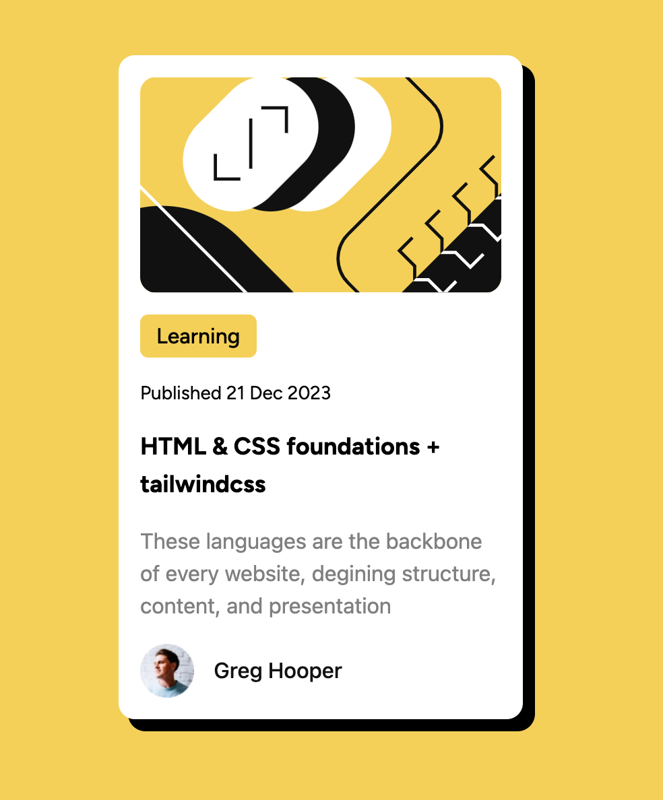

## Table of contents

- [Overview](#overview)
  - [The challenge](#the-challenge)
  - [Screenshot](#screenshot)
- [My process](#my-process)
  - [Built with](#built-with)
  - [What I learned](#what-i-learned)
  - [Continued development](#continued-development)s
- [Acknowledgments](#acknowledgments)

**Note: Delete this note and update the table of contents based on what sections you keep.**

## Overview
A simple practice that i decided to  use to practice tailwind, not just the use of the styles but also the understanding of the tailwing.config.js where i added custom styles to use on the file

### The challenge

Users should be able to:

- See hover and focus states for all interactive elements on the page

### Screenshot

### Links

- Solution URL: [Github](https://github.com/lingowmx/blog-preview-card-fm)
- Live Site URL: [Github Pages](https://lingowmx.github.io/blog-preview-card-fm/)

## My process
I started remember how to install tailwind and the configuration that i need to workl with just vanilla js
Then build my HTML, then add the tailwind styles. Doing this help me to understant other thing that are necessary when working with tailwind, like the usage in the tailwind.config.js

### Built with

- Semantic HTML5 markup
- TailwindCSS
- Flexbox
- Mobile-first workflow

### What I learned

The usage of the tailwind.congi.js and some basic styles with tailwindcss

